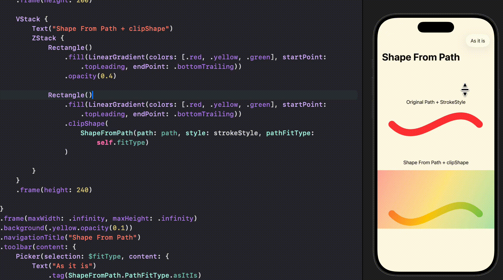

# SwiftUI_ShapeFromPath
Convert a Path to a shape with a specific StrokeStyle and path fit type to be used with contentShape or clipShape modifiers.

For more details, please refer to my article: [SwiftUI: Convert Path With A Given StokeStyle To Shape]()

